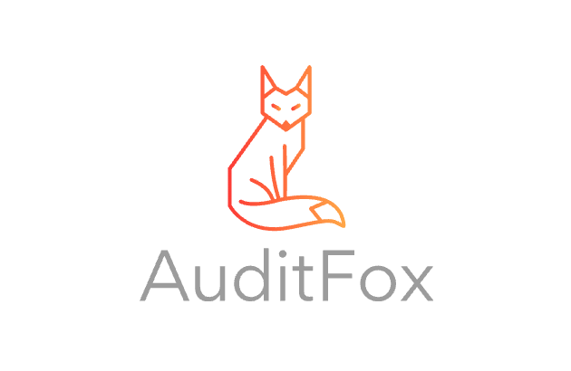

AuditFox is a high-performance, Go-powered system for storing and querying audit logs, ensuring traceability and security for modern applications. 🚀

## 🔥 Features

- **Blazing Fast** ⚡ - Optimized for speed with Go’s concurrency model.
- **Flexible Storage** 🗄️ - Supports multiple databases (PostgreSQL, MySQL, SQLite, etc.).
- **Secure & Reliable** 🔒 - Ensures tamper-proof audit logs with cryptographic integrity.
- **Easy Integration** 🔗 - Lightweight and designed for quick adoption.
- **Scalable** 📈 - Built to handle high-throughput environments efficiently.

## 📜 License

AuditFox is licensed under the [GPL-3.0](https://www.gnu.org/licenses/gpl-3.0.html).

## ⚖️ Copyright

© 2025 AuditFox. AuditFox is a trademark of its respective owner. This software is provided under the GPL-3.0 license, ensuring freedom to use, modify, and distribute while preserving the project's open-source integrity.

## 🤝 Contributing

We welcome contributions! Feel free to submit pull requests or open issues.

---

AuditFox - Secure. Scalable. Reliable. 🦊
